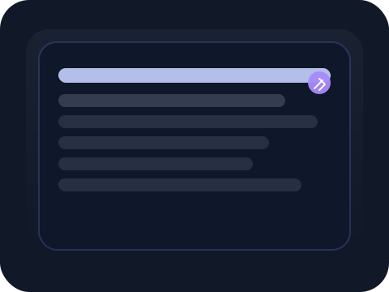

# 📝 Digital Notebook

A calm, private journal with a dark glassmorphism UI, password lock, mood tagging, and searchable entries stored in localStorage.



---

## ✨ Core Features

1. **Private Lock Screen**
   - Secure access with a localStorage password.
   - First-time use prompts password setup.

2. **Mood-Aware Journal Entries**
   - Choose from mood tags like 😊, 😔, 😠, 😴, ✨.
   - Mood selection is reflected in saved entries.

3. **Searchable History**
   - Instantly filter entries by title or content.
   - Entries are displayed in reverse chronological order.

4. **Dark Comfy UI**
   - Soft glass cards, blurred backgrounds, and relaxed spacing.
   - Theme toggle for light/dark styling.

5. **Local Persistence**
   - Saves journal entries and theme preference using localStorage.

---

## 📂 Project Files

```text
Digital Notebook/
├── index.html       # Core journal UI, lock screen, and entry logic
├── project.json     # Project metadata for the showcase index
├── README.md        # Project documentation
└── thumbnail.svg    # Project thumbnail graphic
```

---

## 🚀 Run Locally

Open `Projects/Digital Notebook/index.html` in your browser, or serve the folder with a local server.

No build or install is required.
